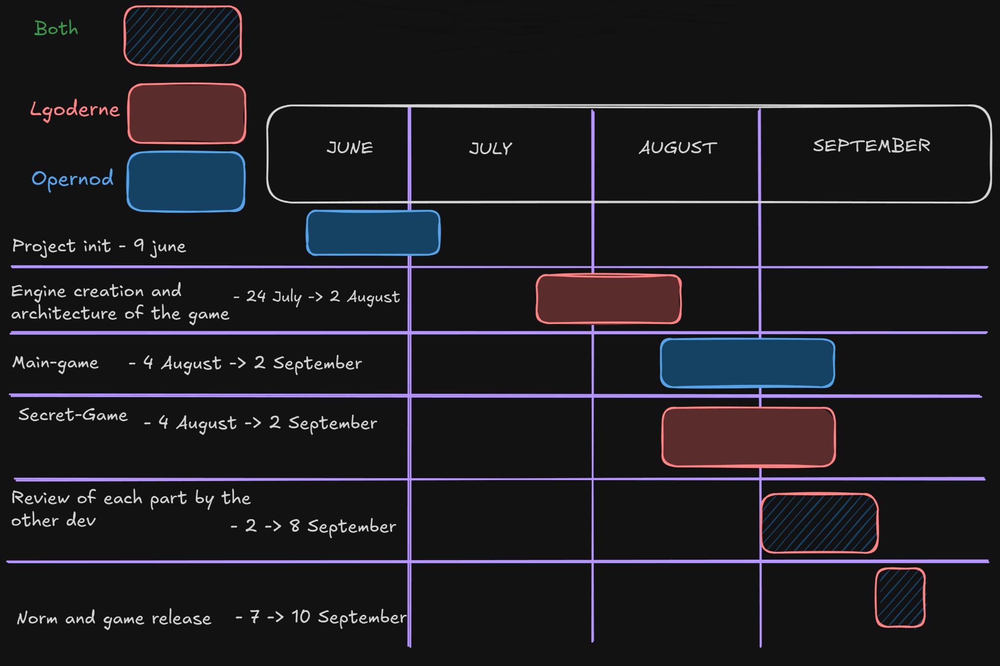

*This project has been created as part of the 42 curriculum by lgoderne and opernod.*

# Pac-Man: Global Offensive

## Description

Pac-Man: Global Offensive is a Python 3 recreation of the classic Pac-Man arcade game. It uses [PySDL2](https://pysdl2.readthedocs.io/) for windowing, input and rendering, and [NumPy](https://numpy.org/) for efficient pixel and framebuffer operations.

The project combines the familiar Pac-Man rules with a 42-themed presentation and several additional game systems:

- Main menu with highscore display and instructions.
- In-game HUD showing score, lives, level and remaining time.
- Procedurally generated levels.
- Ghost AI and player collision handling.
- Pac-gums, super pac-gums and temporary vulnerable-ghost states.
- Cheat mode, including score, life, level and invincibility controls.
- Level and time management.
- Victory, defeat and persistent highscore screens.
- An optional Counter-Strike-inspired secret game.

## Requirements

- Python 3.12 or newer. The project metadata declares `requires-python = ">=3.12"`.
- `uv` is recommended for reproducible dependency installation. `pip` can also install the dependencies listed in `pyproject.toml`.
- A desktop environment with SDL2 support.
- The assets included in this repository, including the font, sprites and maze resources.

## Installation

From the project directory:

```bash
uv sync
```

Alternatively, download and run the standalone executable from Itch.io:

1. Go to the project page: `https://opernod.itch.io/pacman-go`
2. Enter the access password: `MonLeo!`
3. Download the `.zip` archive.
4. Extract the file and run the executable directly.

## Instructions

The game requires one configuration-file argument:

```bash
python3 pac-man.py config.json
```

With `uv`:

```bash
uv run python pac-man.py config.json
```

The Makefile provides the usual project commands:

| Command | Description |
| --- | --- |
| `make install` | Installs dependencies with `uv sync`. |
| `make run` | Starts the game with `config.json`. |
| `make debug` | Runs the program under Python's `pdb` debugger. |
| `make clean` | Removes Python caches, logs, the virtual environment and generated package data. |
| `make lint` | Runs Flake8 and Mypy checks. |
| `make test` | Runs the configuration/parser test suite found in `test/`. |
| `make package` | Builds a distributable executable with PyInstaller. |


## Configuration

The game is configured through a JSON file passed on the command line. The default file is `config.json`. Configuration validation is performed before SDL is initialized.

The accepted configuration model supports the following values:

| Key | Meaning |
| --- | --- |
| `highscore_filename` | JSON file used to persist high scores, for example `scores.json`. |
| `level` | Conceptual level identifier. In this implementation, level definitions are supplied through `level_array_multiple_levels`. |
| `level_array_multiple_levels` | Array of level definitions. Each entry contains a `name`, `width` and `height`. |
| `width` / `height` | Conceptual maze dimensions. In the current configuration these are stored per level as `width` and `height`; window dimensions use `screen_width` and `screen_height`. |
| `lives` | Number of lives given to the player. |
| `pacgum` | Pac-gum configuration or compatibility key. |
| `points_per_pacgum` | Points awarded for a normal pac-gum. |
| `points_per_super_pacgum` | Points awarded for a super pac-gum. |
| `points_per_ghost` | Points awarded for eating a ghost. |
| `seed` | Base seed used for deterministic maze generation. |
| `level_max_time` | Maximum time allowed for a level. |
| `screen_width` / `screen_height` | SDL window dimensions. |

Example:

```json
{
	"highscore_filename": "scores.json",
	"level_array_multiple_levels": [
		{"name": "level1", "width": 10, "height": 10},
		{"name": "level2", "width": 15, "height": 15}
	],
	"lives": 3,
	"points_per_pacgum": 10,
	"points_per_super_pacgum": 50,
	"points_per_ghost": 200,
	"seed": 42,
	"level_max_time": 90,
	"screen_width": 1280,
	"screen_height": 720
}
```

Configuration files may contain `#` comments in the project configuration format. Comments are removed before validation, so they do not become part of the parsed data.

### Faulty Configuration Handling

The parser validates the file, its extension, required values, level definitions and highscore path before starting the game. Missing or invalid optional gameplay values are converted to safe defaults by the gameplay layer where appropriate, such as a default seed or fallback point values. Invalid structural configuration is rejected cleanly with an error message and without exposing a Python traceback to the player.

## Highscores

Scores are persisted in the JSON file specified by `highscore_filename`. A saved entry has this shape:

```json
{
	"name": "Player 42",
	"point": 12345
}
```

The highscore menu displays the best ten entries. Save names are limited to ten characters and may contain only ASCII letters, digits and spaces. Scores are non-negative integers.

The save pipeline is centralized in `EndScreen.save_and_quit()`. It validates the name, reads the existing JSON data, appends the current score, writes the updated file and then performs the requested navigation callback. Keeping these operations together makes the victory, defeat and pause-menu save paths behave consistently and prevents partial duplicate save implementations.

## Maze Generation

The game integrates the external `A-Maze-ing` generator package through the local wheel in `mazegenerator-00001/`. The package is consumed as a dependency and its source code is not modified by this project.

An adapter in the game translates generated maze cells into the internal map representation and gameplay coordinates:

- Level 1 can use a fixed seed such as `42` for reproducible testing.
- Later levels use pseudo-random seeds derived from the configured base seed and level progression.
- `PERFECT = False` is used so the maze can contain looping corridors, which are important for Pac-Man movement and ghost pursuit.
- Wall data uses bitwise encoding: North = `1`, East = `2`, South = `4`, West = `8`.

The generated structure is also used to determine valid movement cells and item placement. Inaccessible cells, including cells occupied by the 42 logo area, do not receive playable items.

## Implementation

The application runs an SDL event/render loop. Each frame polls input, updates the active scene, draws the scene and presents the renderer at the target frame rate.

Important mechanics include:

- Player movement with buffered turns and collision checks against maze walls.
- Normal pac-gums and super pac-gums placed only on reachable corridor cells.
- Removal of items from inaccessible cells and the central 42-logo area.
- Ghost navigation, collision detection and vulnerable/dead states.
- Animated sprites selected from directional and state-specific sprite sheets.
- A temporary super-pac-gum state that changes ghost behavior and player feedback.
- An invincibility cheat state that bypasses normal player damage.
- Level completion, life loss, timers and transitions between game scenes.

## General Software Architecture

The project is organized around scenes and small gameplay components:

| Component | Responsibility |
| --- | --- |
| `Window` | Initializes SDL, creates scenes and owns the main application loop. |
| `Game` | Coordinates gameplay state, levels, items, timing, cheats and scene transitions. |
| `PacPlayer` | Handles player movement, animation, item consumption and player state. |
| `Ghost` | Represents ghost movement, targeting, animation and vulnerable states. |
| `SdlEvent` | Routes SDL keyboard, text, mouse and window events to the active scene. |
| `Button` | Provides reusable button geometry and interaction support for menus. |
| `EndScreen` | Renders victory/defeat screens and owns the complete score-save pipeline. |
| `MainMenu` | Renders the main menu, instructions and highscores. |
| `Transition` | Coordinates visual transitions between scenes. |

`Window` selects the active scene from `GameState`. `SdlEvent` forwards input to that scene, while the scene updates its own state and renders through shared drawing helpers. `Game` owns the running game and supplies the current score to `EndScreen` when a save is requested.

## Project Management

Work was organized through task allocation and incremental integration. Features were divided into gameplay, rendering, configuration, testing and tooling tasks. Risk management focused on SDL resource lifetime, malformed configuration files, generated-maze compatibility, collision correctness and persistence failures.

The acceptance test plan covers:

- Valid and invalid configuration files.
- Game launch and scene transitions.
- Player, ghost, item and timer behavior.
- Cheat-mode state changes.
- Victory/defeat handling and score persistence.
- Invalid highscore names and malformed highscore files.



If you want to see pushes more clearly
```bash
git log --oneline --graph --decorate --all
```

## Resources

- [PySDL2 documentation](https://pysdl2.readthedocs.io/)
- [SDL2 wiki](https://wiki.libsdl.org/SDL2/FrontPage)
- [NumPy documentation](https://numpy.org/doc/)
- [Pydantic documentation](https://docs.pydantic.dev/)
- [Python documentation](https://docs.python.org/3/)
- 42 Other students
- The external `A-Maze-ing` generator supplied as the local project dependency.
- 42 project subject, evaluation criteria and peer-review feedback.
- AIs

## AI Usage

AI tools were used transparently as development assistance. Their use included:

- Explaining existing code paths and tracing scene, input and score-save flows.
- Suggesting and checking focused test cases for configuration.
- Assisting with debugging syntax, integration and validation issues.
- Helping draft and structure this documentation.
- Explaining new awareness about the project

